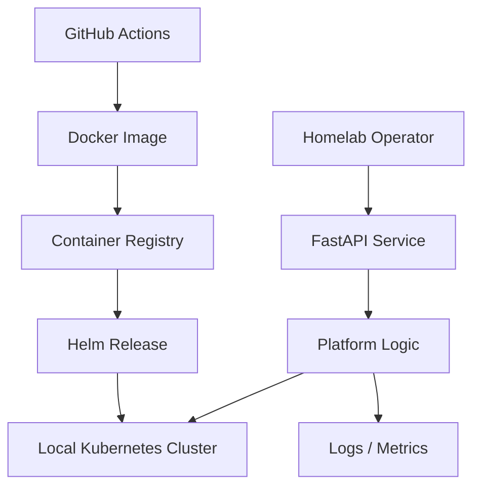

# Architecture

```mermaid
flowchart TB
    User[Homelab Operator] --> Api[FastAPI Service]
    Api --> Orchestrator[Platform Logic]
    Orchestrator --> Cluster[Local Kubernetes Cluster]
    Orchestrator --> Telemetry[Logs / Metrics]
    CI[GitHub Actions] --> Image[Docker Image]
    Image --> Registry[Container Registry]
    Registry --> Helm[Helm Release]
    Helm --> Cluster
```
